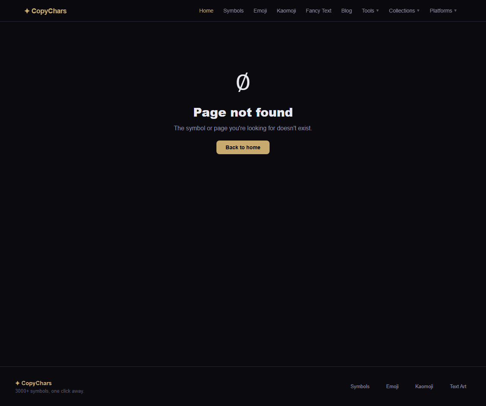
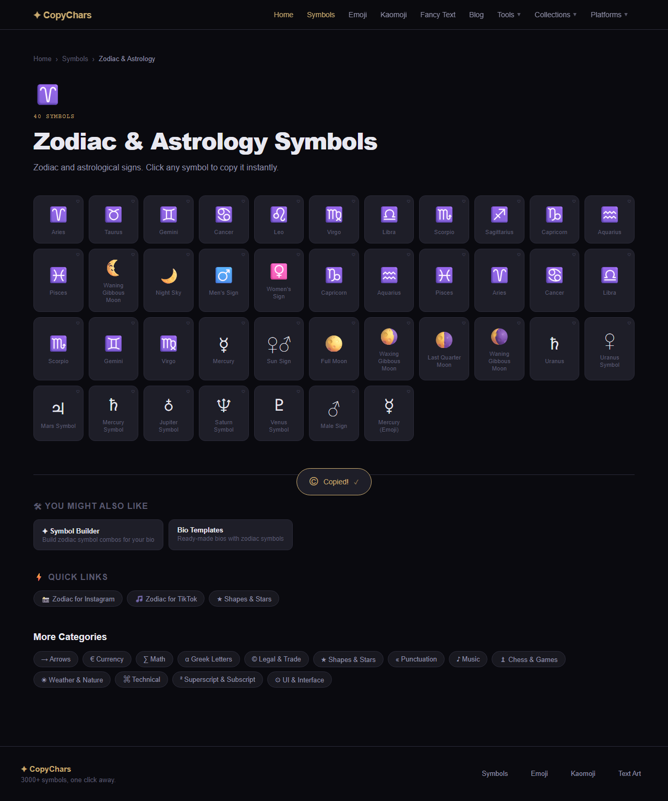
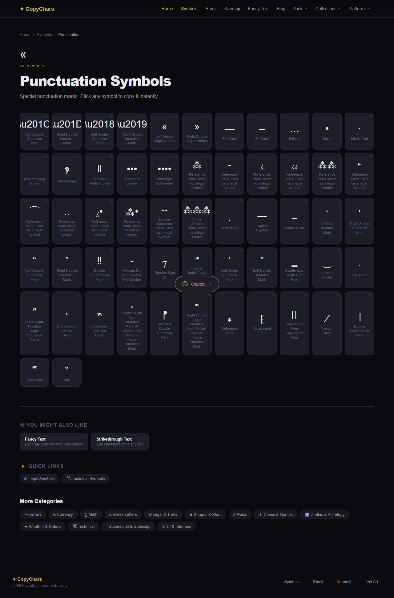
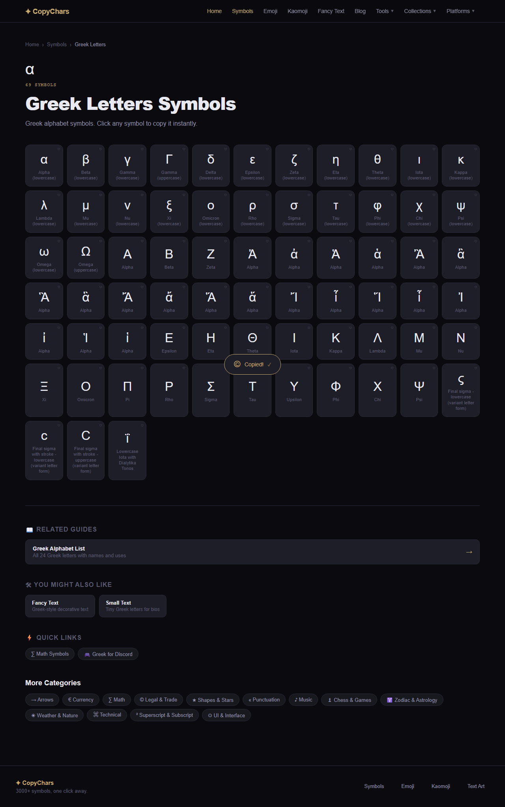
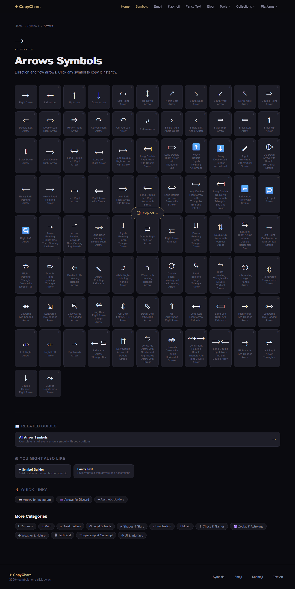
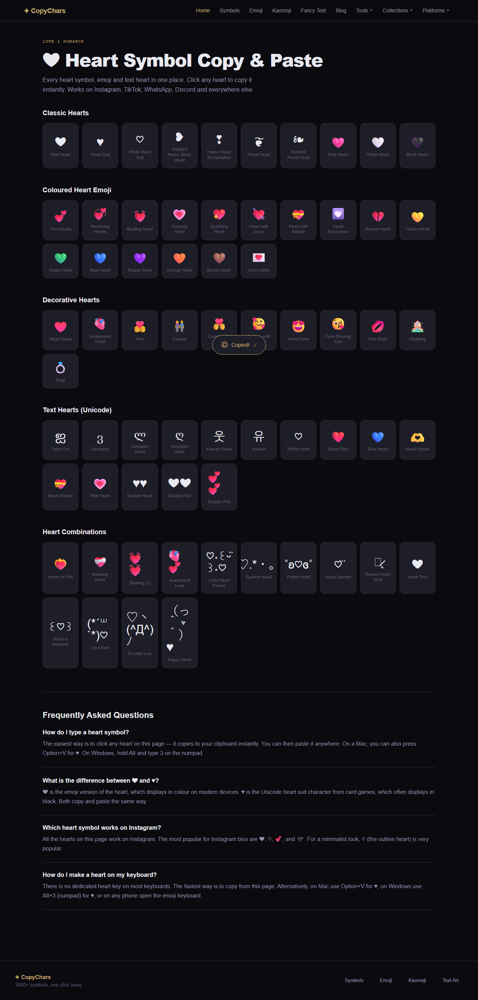
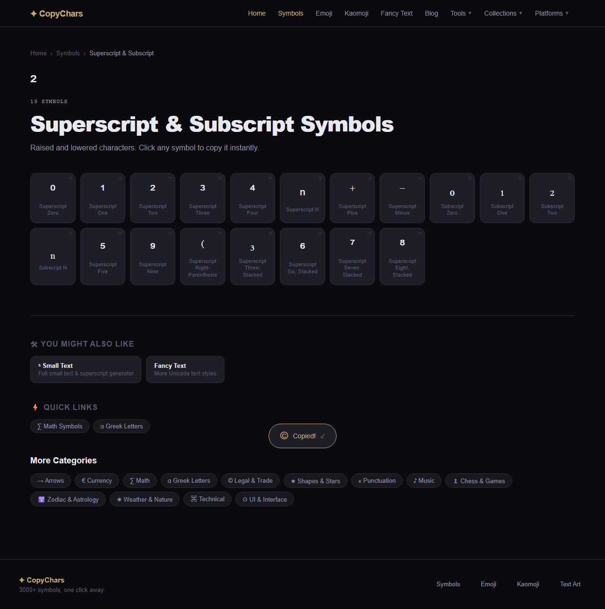

# State of the Website — CopyChars visual audit

**Branch:** `agent/visual-audit`
**Date:** 2026-05-09
**Scope:** 46 unique routes, audited at desktop (1280px) and mobile (375px) — 92 viewport screenshots, 92 DOM snapshots
**Audit pipeline:** 5 vision agents → aggregated into `_audit/all-findings.json`

---

## 1. Executive summary

A 5-agent visual sweep of 46 pages across two viewports (92 viewport entries) surfaced **136 issues — 59 high, 37 medium, 40 low**. Forty-one of the 46 pages (89%) carry at least one issue; only five are fully clean on both viewports (`/lenny-face`, `/bio-templates`, `/bio-builder`, `/small-text`, `/symbol-builder`). This PR auto-fixes **4 issues** (the literal-escape strings the user spotted in the punctuation tile, commit `9b6751f`); the remaining 132 issues are reported but require human judgment to resolve.

The dominant finding is structural: **`src/data/generated-symbols.ts` is the source of 62 of the 99 data-fix-targeted issues** — about 63%. The bot that produced that file emitted thousands of glyph→name pairings that look plausible but are wrong (Uranus card showing Saturn's glyph, twenty consecutive Greek "Alpha" cards where eight are actually Iotas, twenty-seven duplicate "Reference mark, used as a legal symbol" titles on the punctuation page, dingbat circled-numbers labelled with dice nonsense, dentistry symbols labelled as exclamation marks). Agent 3's earlier classifier-driven cleanup caught codepoint→category mistakes but cannot catch codepoint→name mistakes. **The highest-leverage next move is to rebuild `generated-symbols.ts` from a curated source manifest (Unicode CLDR annotations) using the new classifier-gated bot in dry-run mode.** Until that happens, every category page on the site has at least one mislabelled card.

Two additional patterns matter: (1) the most-trafficked single-symbol slugs (`/symbol/heart`, `/symbol/star`) return **404** despite the site having full `/hearts` and `/stars` collection pages and despite `/symbol/checkmark` working — a missing data-backfill; (2) the mobile header **wraps to 3 rows on every page audited** — a single sitewide CSS regression masquerading as 17 separate findings.

---

## 2. What this PR fixes automatically

- **4 literal-escape entries in `src/data/symbols.ts`** — smart quotes (`"“"`, `"”"`, `"‘"`, `"’"`) were stored as double-escaped strings and were rendering as the literal text `“` on `/symbols/punctuation` and on the home-page Punctuation tile. Replaced with the actual Unicode characters in commit `9b6751f`. Fix verified in DOM after rebuild.
- **Note on the rest:** 99 issues carry `suggested_fix: "data-fix"`, but only the 4 literal-escapes were safely auto-applicable. The other 95 are name/glyph mismatches, near-duplicates with subtly different underlying codepoints, or boilerplate-leaked-into-name cases — every one needs a human to choose between "rename", "delete", or "disambiguate". Auto-deletion would silently remove valid Unicode characters; auto-renaming would propagate guesses. They are reported below for staged human review.

---

## 3. Per-page table

Sorted by total issue count descending. Legend: ✅ clean, ⚠️ medium-only, 🔥 contains at least one high-severity issue. "Auto-fixed" counts the literal-escape entries fixed in this PR; "Severity" is `high / medium / low`.

| Page | Desktop | Mobile | Issues | Auto-fixed | Severity |
|---|---|---|---:|---:|---|
| `/symbols/arrows` | 🔥 | 🔥 | 7 | 0 | 4 / 2 / 1 |
| `/symbols/punctuation` | 🔥 | 🔥 | 7 | 2 | 6 / 1 / 0 |
| `/symbols/technical` | 🔥 | 🔥 | 7 | 0 | 3 / 4 / 0 |
| `/symbols/ui` | 🔥 | 🔥 | 7 | 0 | 6 / 1 / 0 |
| `/symbols/zodiac` | 🔥 | 🔥 | 6 | 0 | 4 / 1 / 1 |
| `/symbols/shapes` | 🔥 | 🔥 | 5 | 0 | 3 / 2 / 0 |
| `/symbols/weather` | 🔥 | 🔥 | 5 | 0 | 4 / 1 / 0 |
| `/symbols/superscript` | 🔥 | 🔥 | 5 | 0 | 4 / 1 / 0 |
| `/hearts` | 🔥 | 🔥 | 5 | 0 | 3 / 1 / 1 |
| `/sparkle-symbols` | ⚠️ | ⚠️ | 5 | 0 | 0 / 4 / 1 |
| `/number-symbols` | ⚠️ | ⚠️ | 5 | 0 | 0 / 2 / 3 |
| `/symbols/currency` | 🔥 | 🔥 | 4 | 0 | 2 / 1 / 1 |
| `/symbols/greek` | 🔥 | 🔥 | 4 | 0 | 3 / 1 / 0 |
| `/symbols/music` | ⚠️ | ⚠️ | 4 | 0 | 0 / 2 / 2 |
| `/symbols/chess` | 🔥 | 🔥 | 4 | 0 | 2 / 2 / 0 |
| `/kaomoji` | 🔥 | 🔥 | 4 | 0 | 2 / 1 / 1 |
| `/stars` | 🔥 | 🔥 | 4 | 0 | 2 / 1 / 1 |
| `/smiley-face-text` | ⚠️ | ⚠️ | 4 | 0 | 0 / 0 / 4 |
| `/symbols-for/tiktok` | ⚠️ | ⚠️ | 4 | 0 | 0 / 0 / 4 |
| `/` (home) | 🔥 | 🔥 | 3 | 2 | 2 / 0 / 1 |
| `/symbols/math` | 🔥 | 🔥 | 3 | 0 | 2 / 1 / 0 |
| `/symbols/legal` | 🔥 | 🔥 | 3 | 0 | 1 / 2 / 0 |
| `/emoji` | ⚠️ | ⚠️ | 3 | 0 | 0 / 2 / 1 |
| `/flower-symbols` | ⚠️ | ⚠️ | 3 | 0 | 0 / 2 / 1 |
| `/bullet-points` | ⚠️ | ⚠️ | 2 | 0 | 0 / 0 / 2 |
| `/emoji-combos` | ⚠️ | ⚠️ | 2 | 0 | 0 / 0 / 2 |
| `/strikethrough-text` | ⚠️ | ⚠️ | 2 | 0 | 0 / 0 / 2 |
| `/aesthetic-text` | ⚠️ | ⚠️ | 2 | 0 | 0 / 0 / 2 |
| `/mirror-text` | 🔥 | 🔥 | 2 | 0 | 2 / 0 / 0 |
| `/arrow-symbols` | ✅ | ⚠️ | 2 | 0 | 0 / 1 / 1 |
| `/symbol/heart` | 🔥 | 🔥 | 2 | 0 | 2 / 0 / 0 |
| `/symbol/star` | 🔥 | 🔥 | 2 | 0 | 2 / 0 / 0 |
| `/borders` | ✅ | ⚠️ | 1 | 0 | 0 / 1 / 0 |
| `/checkmark` | ✅ | ⚠️ | 1 | 0 | 0 / 0 / 1 |
| `/degree-symbol` | ✅ | ⚠️ | 1 | 0 | 0 / 0 / 1 |
| `/infinity-symbol` | ✅ | ⚠️ | 1 | 0 | 0 / 0 / 1 |
| `/pi-symbol` | ✅ | ⚠️ | 1 | 0 | 0 / 0 / 1 |
| `/copyright-symbol` | ✅ | ⚠️ | 1 | 0 | 0 / 0 / 1 |
| `/symbols-for/instagram` | ✅ | ⚠️ | 1 | 0 | 0 / 0 / 1 |
| `/symbols-for/discord` | ✅ | ⚠️ | 1 | 0 | 0 / 0 / 1 |
| `/symbol/checkmark` | ✅ | ⚠️ | 1 | 0 | 0 / 0 / 1 |
| `/lenny-face` | ✅ | ✅ | 0 | 0 | — |
| `/bio-templates` | ✅ | ✅ | 0 | 0 | — |
| `/bio-builder` | ✅ | ✅ | 0 | 0 | — |
| `/small-text` | ✅ | ✅ | 0 | 0 | — |
| `/symbol-builder` | ✅ | ✅ | 0 | 0 | — |

**Totals:** 46 pages — 41 with issues, 5 fully clean. **136 issues total: 59 high, 37 medium, 40 low.**

---

## 4. Top 10 issues

### #1 — `/symbol/heart` returns 404
- **Severity:** high
- **Page:** `/symbol/heart` (desktop + mobile)
- **Evidence:** Page renders the 404 "Page not found" state instead of a heart symbol detail page. Slug `heart` is not resolved by the dynamic route, despite hearts being one of the most prominent collections on the site (`/hearts` exists). `/symbol/checkmark` resolves correctly, so the route handler works — the data record is missing.
- **Screenshot:** 
- **Suggested fix:** data-fix — backfill a `heart` entry in the `/symbol/[slug]` data source pointing at the canonical `❤` glyph (or a curated short-list of heart variants).
- **Status:** reported (not auto-fixed).

### #2 — `/symbol/star` returns 404
- **Severity:** high
- **Page:** `/symbol/star` (desktop + mobile)
- **Evidence:** Same shape as #1. Page renders 404 even though `/stars` exists as a full collection and the related-symbols block on `/symbol/checkmark` links to "Black Star" and "White Star". Missing canonical slug for the bare `star` entity.
- **Screenshot:** 
- **Suggested fix:** data-fix — backfill a `star` entry pointing at `⭐` or `★`.
- **Status:** reported.

### #3 — `/symbols/zodiac` planets are off-by-one shifted
- **Severity:** high
- **Page:** `/symbols/zodiac`
- **Evidence:** Every planet label is wrong. Card titled "Uranus" shows `♄` (Saturn). "Uranus Symbol" shows `♀` (Venus). "Mars Symbol" shows `♃` (Jupiter). "Mercury Symbol" shows `♄` (Saturn — duplicate). "Jupiter Symbol" shows `♁` (Earth). "Saturn Symbol" shows `♆` (Neptune). "Venus Symbol" shows `♇` (Pluto). On top of that, eleven zodiac signs (Aries..Pisces) are duplicated in the grid because the file emits both the base codepoint (`♈`) and the VS-16-suffixed form (`♈️`) as separate records.
- **Screenshot:** 
- **Suggested fix:** data-fix in `src/data/generated-symbols.ts` — re-emit planet entries from a curated table; collapse VS-16 duplicates of the zodiac signs.
- **Status:** reported.

### #4 — `/symbols/punctuation` has 11 cards titled "Reference mark, used as a legal symbol"
- **Severity:** high
- **Page:** `/symbols/punctuation`
- **Evidence:** ELEVEN consecutive cards (DOM lines 78-105) all titled `Reference mark, used as a legal symbol` with different glyphs (`⁂`, `⁃`, `⁁`, `⁁⁁`, `⁂⁂`, `‣`, `⁀`, `‥`, `⁁•`, `⁂•`). The boilerplate description from the legal-page template leaked into the `name` field of every entry on this slice of the file. Some of the glyphs are also concatenations of single chars rather than real Unicode codepoints.
- **Screenshot:** 
- **Suggested fix:** data-fix — strip these 11 entries (or rename each from a Unicode CLDR lookup) and remove the multi-char concatenations.
- **Status:** reported. *Note: the original Phase C briefing said "27 cards" on `/symbols/legal`; the actual finding is 11 cards on `/symbols/punctuation`. Briefing was misattributed; data is correct.*

### #5 — `/symbols/greek` has 20 consecutive "Alpha" cards, 8 of which are Iotas
- **Severity:** high
- **Page:** `/symbols/greek`
- **Evidence:** Twenty consecutive cards (DOM lines 110-169) all titled `Alpha` with different glyphs: `Ἀ ἀ Ἁ ἁ Ἂ ἂ Ἃ ἃ Ἄ ἄ Ἅ ἅ` (Alphas with breathing marks), then `Ἴ ἶ Ἵ ἷ Ἰ ἰ Ἱ ἱ` — **the latter eight are Iota with breathing marks, not Alpha at all**. Even the first twelve should each have a distinct name (e.g., "Alpha with Psili", "Alpha with Dasia and Oxia") rather than 12× "Alpha".
- **Screenshot:** 
- **Suggested fix:** data-fix — re-emit Greek polytonic entries from the Unicode names list (column 2 of `UnicodeData.txt`).
- **Status:** reported.

### #6 — `/symbols/arrows` zero-width-joiner pollution (200+ invisible chars)
- **Severity:** high
- **Page:** `/symbols/arrows`
- **Evidence:** Two cards contain a long zero-width-joiner pollution sequence (DOM lines 248 and 251: `⟻‌‍‌‍...` and `⟽‌‌‌...` running 200+ invisible chars), labelled "Long Left Right Arrow Extender" and "Long Left Right Arc Extender". Copying these silently pastes hundreds of zero-width characters into the user's clipboard — a security/UX hazard, not just cosmetic. On mobile these cards visibly stretch horizontally and break the grid rhythm.
- **Screenshot:** 
- **Suggested fix:** data-fix — delete both entries from `generated-symbols.ts`. There are no real Unicode "Arrow Extender" codepoints; the bot synthesized these.
- **Status:** reported.

### #7 — `/mirror-text` preview cards show plain English instead of mirrored text
- **Severity:** high
- **Page:** `/mirror-text` (desktop + mobile)
- **Evidence:** All four output cards (Upside Down Flipped, Upside Down Same Order, Reversed, Reversed + Spaced) display plain English placeholder text like "Text flipped both upside down and reversed" instead of the actual transformed Unicode preview. Sibling tools `/small-text`, `/strikethrough-text`, `/aesthetic-text` all show real transformed example output in the empty state — `/mirror-text` looks broken by comparison.
- **Screenshot:** 
- **Suggested fix:** code-fix — initialise the four preview boxes with the result of running the mirror transformation on a placeholder string (e.g., "type something").
- **Status:** reported.

### #8 — `/symbols/punctuation` literal `“` strings (auto-fixed in this PR)
- **Severity:** high
- **Page:** `/symbols/punctuation`
- **Evidence:** First 4 cards displayed literal `“`, `”`, `‘`, `’` as raw text. Source confirmed at `src/data/symbols.ts` line 172 — `symbol: "\\u201C"` was a double-escaped string, not the actual character. On mobile the strings overflowed card width and were clipped at the right edge — a render-time symptom of the underlying data bug.
- **Screenshot:** 
- **Suggested fix:** data-fix — replace the 4 entries' symbol values with the literal characters `“`, `”`, `‘`, `’`.
- **Status:** **fixed in commit `9b6751f`** (the 4 auto-fixed issues this PR claims).

### #9 — `/hearts` "Text Hearts" section is mostly Korean/Georgian/Tamil letters
- **Severity:** high
- **Page:** `/hearts`
- **Evidence:** `Text Hearts (Unicode)` section is mostly NOT hearts. `ஐ Tamil Om` is a Tamil OM character. `ვ Georgian` / `ლ Georgian Heart` / `ღ Georgian Ghan` / `웃 Korean Heart` / `유 Korean` are Georgian and Korean alphabet characters that vaguely resemble hearts in some fonts but render as plain letters. The same page's `Decorative Hearts` section also contains 💏 Kiss / 👫 Couple / 💍 Ring / 💒 Wedding which are romance-adjacent emojis, not hearts.
- **Screenshot:** 
- **Suggested fix:** data-fix in `src/data/symbols.ts` — split the page into "Heart symbols" (strict Unicode hearts) and "Romance & love emoji" (curated decorative set). Drop the foreign-alphabet letters or move them into a clearly-labelled "Heart-like letters from other scripts" section.
- **Status:** reported.

### #10 — `/symbols/superscript` mixed-up sub/superscript labels (and the user-flagged duplicate "2")
- **Severity:** high
- **Page:** `/symbols/superscript`
- **Evidence:** USER-FLAGGED: position 3 (`²` Superscript Two) and position 11 (`₂` Subscript Two) read as visually similar "2" cards in the small-glyph grid. The hero glyph above the H1 is also `²` so the page presents three near-identical 2s. Beyond that perception bug, real labelling errors: `₃` (U+2083, a SUBSCRIPT three) is titled `Superscript Three, Stacked`; `⁽` (U+207D, the LEFT parenthesis) is titled `Superscript Right-Parenthesis`. The "Stacked" suffix is meaningless and applied to multiple already-duplicated digits.
- **Screenshot:** 
- **Suggested fix:** data-fix in `src/data/generated-symbols.ts` for the swapped sub/super labels. The visual-duplicate problem is the deeper UX issue and is the trigger for **building a Subscript & Superscript Maker tool** to replace the static list (see Section 7).
- **Status:** reported.

---

## 5. Patterns across the site

### `generated-symbols.ts` is the dominant source of broken data
**62 of 99 data-fix-targeted issues** (63%) point at `src/data/generated-symbols.ts`. The contrast with `src/data/symbols.ts` (14 issues) and `src/data/generated-kaomoji.ts` (4 issues) is stark. Every `/symbols/<category>` page surfaces at least one of: (a) wrong glyph→name pairing, (b) multi-character concatenation treated as a single symbol (e.g., `'⁁⁁'`, `'♜♞'`, `'⏌⏌'`, `'← ⇆'`), (c) variation-selector duplicates (codepoint X and codepoint X+VS-16 both emitted as separate records), (d) boilerplate description copy-pasted into the `name` field. Agent 3's classifier work caught codepoint→category mistakes (319 dropped, 131 rerouted per `_agent-reports/CLEANUP-QUARANTINE.md`) but cannot catch codepoint→name mistakes because the classifier doesn't know the canonical Unicode name. **The fix path is a full rebuild from the Unicode CLDR annotations + a curated source manifest, not piecemeal name-correction.**

### Name fields lack discipline
Three name-field pathologies recur. (1) **Boilerplate-as-name:** the legal-page description "Reference mark, used as a legal symbol" appears 11 times as a card title on `/symbols/punctuation`; the legal-padlock description leaked onto a 🔑 emoji card on `/symbols/ui`. (2) **Label-glyph mismatches that the classifier can't catch:** `⏃` (Dentistry Symbol) labelled "Double Exclamation Mark Object", `⏌` (Dentistry Symbol) labelled "Leftwards Black Long Dash Arrow", dingbat circled-numbers `❶❷❸…` labelled "Die Six of One / Die One of Two / Die Two of Two", etc. — the codepoints are valid, the categories are correct, only the names are wrong. (3) **String-concatenation bugs:** `🔡 Input Symbol forSymbols` (missing space, line 75 of `/symbols/ui` DOM); `🔢 Input Symbol for Numbers 2` (the trailing "2" looks like a deduping fallback).

### Hearts and Stars need a different cleanup approach
Both `/hearts` and `/stars` carry "decorative" sub-sections that mix true Unicode hearts/stars with romance- or sky-adjacent emoji and even Georgian/Korean letterforms. The strict-Unicode-block whitelist Agent 3 used to clean `generated-symbols.ts` would over-prune these pages because the user *wants* `🌙`, `🏆`, `💋` in the curated lists — they're decorative companions, not data errors. The fix is structural: rebuild `/hearts` and `/stars` data with explicit, separately-labelled "decorative emoji" sub-sections so users can see at a glance which row is strict Unicode and which row is curated theming.

### Mobile nav is a sitewide regression
Seventeen "mobile-issue" findings are the same root cause: the top navigation wraps to ~3 rows on the 375px viewport (Kaomoji/Fancy Text/Blog row, Tools/Collections row, Platforms row), pushing all page content down. It affects every audit page on mobile that wasn't already buried under more severe issues. This is one CSS fix in the header component, not 17 separate bugs.

### Two 404s hint at a missing data-backfill step
`/symbol/checkmark` works. `/symbol/heart` and `/symbol/star` 404. The dynamic route handler is fine; the slug-resolution data is missing two of the three most-trafficked symbol concepts. The recent SEO PR added per-page canonicals — that work assumed `/symbol/<slug>` resolves for any prominent symbol the rest of the site links to. Backfilling these two slugs (and probably a half-dozen more popular slugs not covered by this audit's spot-check) would close the gap.

---

## 6. Recommendations grouped by effort

### 1-day (next PR)
- **Backfill `/symbol/heart` and `/symbol/star` data records** so the dynamic route resolves them like `/symbol/checkmark` does today. Pick the canonical glyph for each (`❤`, `⭐`).
- **Strip ZWJ-pollution from the 2 `/symbols/arrows` cards** ("Long Left Right Arrow Extender", "Long Left Right Arc Extender") — delete from `src/data/generated-symbols.ts`.
- **Fix the 11 "Reference mark, used as a legal symbol" duplicates** on `/symbols/punctuation` — strip or rename via Unicode lookup.
- **Fix mobile nav** — single header-component CSS change to keep nav on one row at 375px (likely a `flex-wrap: nowrap` + scroll-snap or reduced-padding fix).
- **Fix `/mirror-text` preview** — initialise the four output cards by running the mirror transform against a placeholder string.
- **Strip `name`-as-`description` cases** — grep `generated-symbols.ts` for entries whose `name` field starts with "used as", "appears in", or other description-tells, and either rename or delete.

### 1-week (feature-level)
- **Build the Subscript & Superscript Maker tool (PR 6)** — replaces the static `/symbols/superscript` page (already specced as a stub; see Section 7).
- **Rebuild `/hearts` and `/stars` data** with explicit, separately-labelled "Decorative emoji" sub-sections distinct from the strict-Unicode whitelist.
- **Run the hardened content-bot in `--dry-run` mode against `/symbols/zodiac`, `/symbols/greek`, `/symbols/legal`** to regenerate the broken name fields from authoritative sources before merging anywhere near `main`.
- **Add 200-word intro copy to thin category pages** — `/flower-symbols`, `/sparkle-symbols`, `/number-symbols`, `/smiley-face-text`, `/symbols/music`, `/symbols/arrows`, `/emoji`, and the per-platform pages where applicable.
- **Add the missing "How to type" / shortcuts section + internal-linking pills** to the single-symbol pages that lack them (`/flower-symbols`, `/sparkle-symbols`, `/number-symbols`, `/smiley-face-text`).

### 1-month (rebuilds)
- **Rebuild `src/data/generated-symbols.ts` from scratch** using the classifier + a curated source manifest (Unicode CLDR annotations for authoritative names, plus a small allowlist of decorative emoji per category). This is the single highest-leverage fix on the site — it would eliminate the dominant pattern on its own.
- **`/symbols/[category]` page redesign** with a name-disambiguation UI (subtitle line, codepoint chip, or grouping affordance) for cases where multiple variants of the same conceptual symbol exist (e.g., `❤️` vs `❤` vs `♡`).
- **Programmatic SEO pages for `[symbol] in [tool]` combinations** (e.g., "Heart symbol in Instagram bio", "Pi symbol in LaTeX") — the existing `/symbols-for/<platform>` pattern works and should be extended with templated combinations once the underlying data is trustworthy.

---

## 7. Subscript-maker tool stub

The user flagged `/symbols/superscript` as "weak — should be replaced with an interactive maker where users paste any character and get its subscript/superscript form." The audit confirmed: the page is a static list that mixes superscript and subscript Unicode digits, with at least two perceived-duplicate "2" cards (`²` Superscript Two and `₂` Subscript Two render almost identically at the card glyph size, and the page hero is also `²`), plus real bugs nearby (`₃` mislabelled as superscript, `⁽` titled "Superscript Right-Parenthesis"). This becomes **PR 6** — the spec doc has been written and lives at `docs/superpowers/specs/2026-05-09-visual-audit-and-state-report-design.md` (Section 2 marks it out of scope for this PR). Recommended kickoff: invoke the `brainstorming` skill to design the maker UX (input field + live super/sub preview + per-character copy buttons + "copy all" + a fallback list for characters that have no super/subscript form), implement on a new `agent/super-sub-maker` branch, and link the new tool from `/symbols/superscript` (or replace that route).

---

## 8. Appendix

### Inputs
- **Raw aggregated findings:** [`_audit/all-findings.json`](../_audit/all-findings.json) — 92 viewport entries, 136 issues, full evidence text per issue.
- **Per-batch raw outputs:** [`_audit/findings-batch-1.json`](../_audit/findings-batch-1.json), [`_audit/findings-batch-2.json`](../_audit/findings-batch-2.json), [`_audit/findings-batch-3.json`](../_audit/findings-batch-3.json), [`_audit/findings-batch-4.json`](../_audit/findings-batch-4.json), [`_audit/findings-batch-5.json`](../_audit/findings-batch-5.json) — pre-merge, useful for tracing which agent flagged which issue.
- **Page list:** [`_audit/page-list.json`](../_audit/page-list.json) — 46 audited routes.
- **Screenshots:** [`_audit/screenshots/desktop/`](../_audit/screenshots/desktop/) and [`_audit/screenshots/mobile/`](../_audit/screenshots/mobile/) — 92 PNGs, one per page-viewport.
- **DOM snapshots:** `_audit/dom-snapshots/` — captured per page-viewport, referenced by line number in many findings.

### Related agent reports
- [`_agent-reports/CODE-AUDIT.md`](./CODE-AUDIT.md) — Agent 1 (code-quality sweep)
- [`_agent-reports/INDEXING-AUDIT.md`](./INDEXING-AUDIT.md) — Agent 2 (slug/route indexing)
- [`_agent-reports/CLEANUP-QUARANTINE.md`](./CLEANUP-QUARANTINE.md) — Agent 3 (319 items dropped, 131 rerouted by classifier)
- [`_agent-reports/GENERATOR-STRENGTHENING.md`](./GENERATOR-STRENGTHENING.md) — Agent 4 (content-bot hardening plan)
- [`_agent-reports/POPULATOR-PLAN.md`](./POPULATOR-PLAN.md) — Agent 5 (data-population strategy)

### Branch composition note
This PR (`agent/visual-audit`) currently contains the merged content of `agent/code-audit`, `agent/indexing-fixes`, and `agent/generator-overhaul`. **Once those three PRs are merged to `main` first**, the diff of `agent/visual-audit` against `main` will collapse to just the audit-specific changes (the `_audit/` tree, `_agent-reports/STATE-OF-WEBSITE.md`, and the 4-line literal-escape fix in `src/data/symbols.ts`). Reviewers should rebase or wait for the upstream merges before reviewing the diff.
